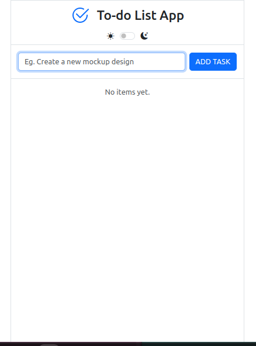
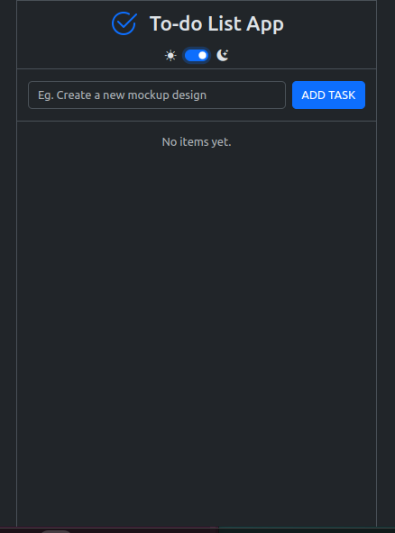
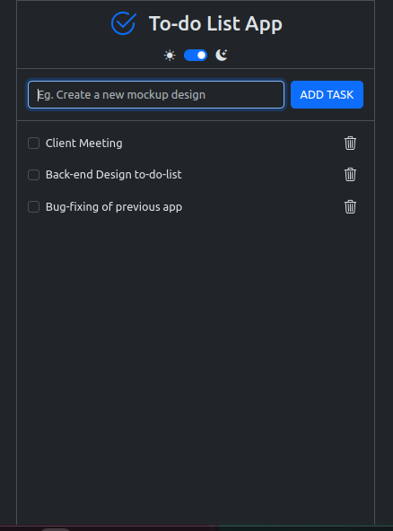

# To-do List App

A simple and elegant To-do List application built with Vite, Bootstrap, and Animate.css. This app helps you manage your daily tasks efficiently with a clean and responsive interface.

## Features

- **Add Tasks:** Quickly add new tasks to your to-do list.
- **Task Management:** Easily mark tasks as completed or delete them.
- **Responsive Design:** Optimized for both desktop and mobile devices.
- **Light/Dark Mode:** Toggle between light and dark modes for a better user experience.


## Screenshots


*light mode*


*Dark mode*


*After add few tasks*


## Installation

1. Clone the repository:
   ```bash
   git clone https://github.com/Asiri-Ekanayaka/to-do-list-app.git

2. Navigate to the project directory:
   ```bash
   cd to-do-list-app

3. Install dependencies:
    ```bash
    npm install

## Usage

1. To start Development Server:
   ```bash
   npm run dev
 
2. To Build for Production:
   ```bash
   npm run build 

3. To Preview Build

   ```bash
   npm run preview 

## License

This project is licensed under the MIT License. See the [LICENSE](./LICENSE.txt) file for details.


## Contact

For any inquiries or feedback, please contact me at asirie95@gmail.com.

